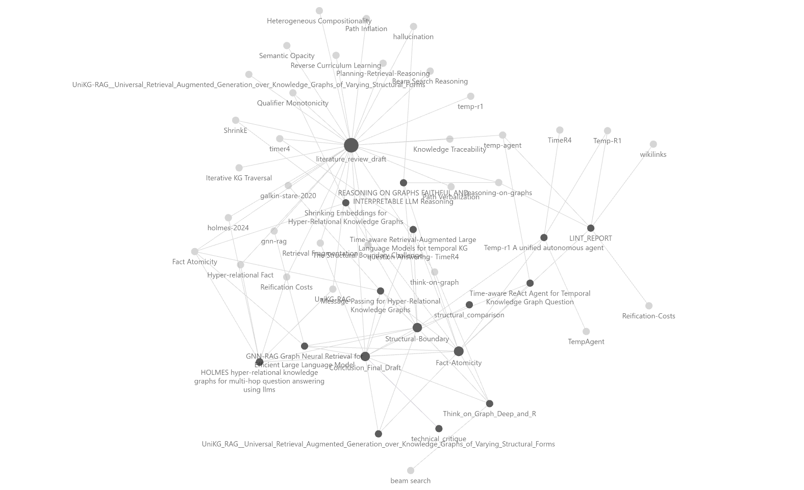

# KG-RAG Research Synthesis Engine

An automated, LLM-orchestrated pipeline for analyzing Knowledge Graph Retrieval-Augmented Generation (KG-RAG) research. This engine identifies technical gaps in triple-based retrieval systems and synthesizes solutions for heterogeneous graph structures.

## 🚀 The Core Problem: The Structural Boundary
Current KG-RAG baselines assume **structural homogeneity**, but research shows that **37.5%** of multi-hop queries require crossing a "Structural Boundary" between plain triples $(h, r, t)$ and hyper-relational facts $(h, r, t, \Omega)$.

This engine was built to quantify the "Reification Tax" paid by traditional models:
* **Path Inflation**: 1.70x increase in reasoning path length.
* **Semantic Opacity**: 24.6% presence of vacuous nodes in reified subgraphs.

## 🛠️ Features
- **Automated Ingestion**: Converts complex PDFs into structured, interlinked Markdown summaries.
- **Logic Linter**: Analyzes the research "wiki" to detect contradictions and link-gaps between baseline methods and unified frameworks.
- **Synthesis Engine**: Generates formal literature reviews and technical critiques focusing on **Fact Atomicity**.

## 🔍 Sample Output
You can view an example of the output generated by the Logic Linter. The file `/samples/lint_report.md` shows how the AI agent identifies contradictions, detects logical gaps, and suggests `[[wikilinks]]` for the KG-RAG research graph. It is a direct product of the `src/lint.py` script.

## 📊 Visualizing the Research
This project is designed to be viewed in **Obsidian**. The interlinked notes create a visual Knowledge Graph of the field, where concepts like "Retrieval Fragmentation" act as hubs connecting failing baselines to modern solutions.

Below is a visualization of the interlinked research wiki in Obsidian, which you can generate after running the full pipeline.

## 🛠️ Setup
1. Clone the repo.
2. Install dependencies: `pip install -r requirements.txt`.
3. Add your `GOOGLE_API_KEY` to a `.env` file.
4. Run `python src/ingestion.py` to begin the pipeline.
